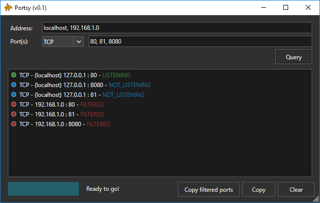

# portsy
Portsy is PortQry UI overlay. It works on tasks so no user interface blocking needed. You can start querying i.e. 100 ports without waiting for all ports to be resolved to see results. Each port is queried in background.

Screenshot:

